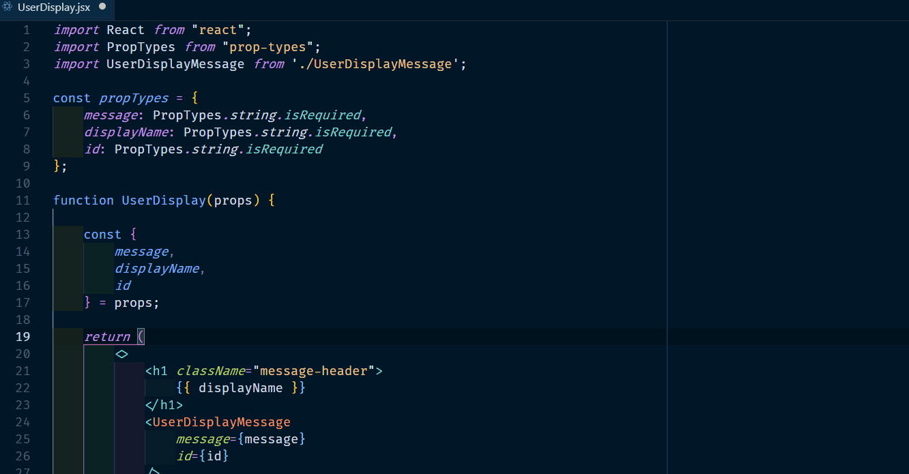
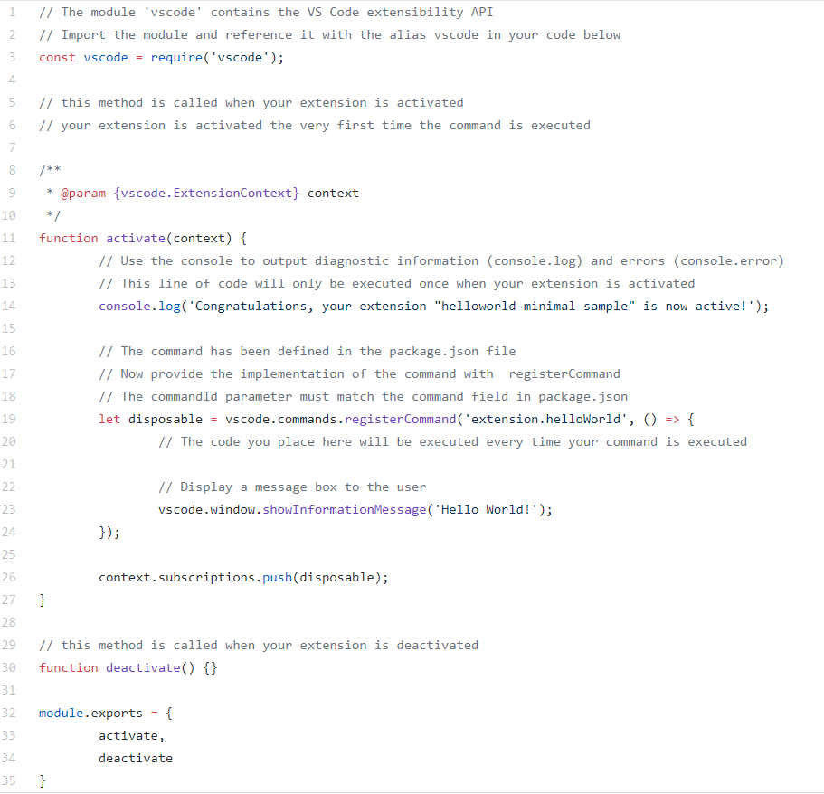
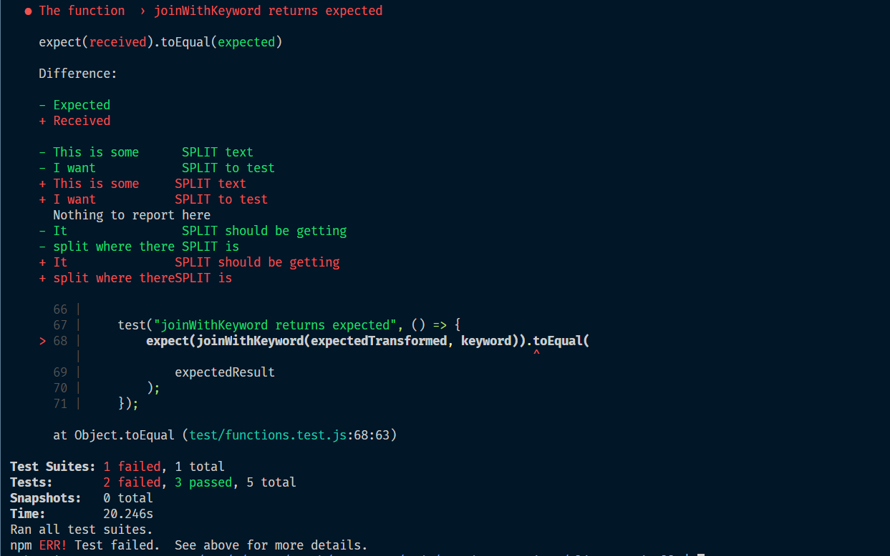
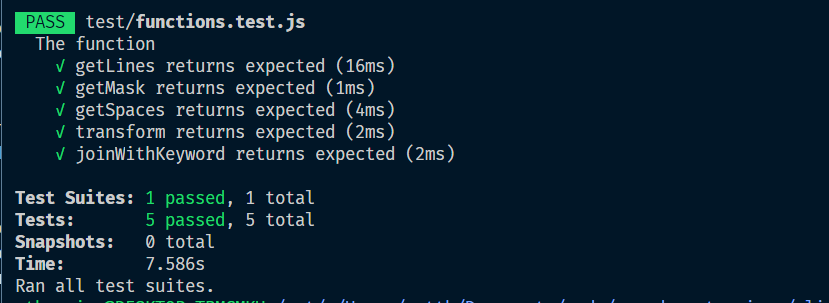

Where I work we have become quite particular about making our code line up vertically in the import sections and when declaring some objects, so that it looks nice and neat! My colleague commented that it would be nice if there was an extension for VS Code that would do the alignment for us, so I made one, and I suspect that this was his plan all along!.

The full code can be found on [my Github](https://github.com/mthorning/align-vertically), I will explain the steps I took to create it below.



## Getting started

The first step is to download Yeoman and the VS Code Extension Generator with NPM:

```
npm install -g yo generator-code
```

Running the generator scaffolds a new project ready for developing. Just type the following and answer the questions:

```
$ yo code


   _-----_     ╭──────────────────────────╮
  |       |    │   Welcome to the Visual  │
  |--(o)--|    │   Studio Code Extension  │
   `---------´   │        generator!        │
  ( _´U`_ )    ╰──────────────────────────╯
  /___A___\   /
   |  ~  |
   __'.___.'__
 ´   `  |° ´ Y `

? What type of extension do you want to create? New Extension (TypeScript)
? What's the name of your extension? my-new-extension
? What's the identifier of your extension? my-new-extension
? What's the description of your extension? It's an extension which is mine and new.
? Enable stricter TypeScript checking in 'tsconfig.json'? No
? Setup linting using 'tslint'? No
? Initialize a git repository? (Y/n) n
```

Once the project has been created and the dependencies have been installed you can open the folder in VS Code to check out the project structure. Pressing F5 starts the debugger and runs your code in a new "Extension Development Host window". What the team at VS Code have done here is great because you can place breakpoints in the main editor whilst trying out the extension you are writing in a development version of VS Code.

That's all I'm going to say about getting setup, I haven't gone into great detail; if you would like a more in-depth article about getting started then I recommend taking a look at [this tutorial](https://code.visualstudio.com/api/get-started/your-first-extension) on VS Code's website.

## Adding a menu item

The first thing I knew that I wanted to do was to add an item to the context menu so that users could right-click on some highlighted text to run the extension. This can be achieved through the _package.json_, just add the following to the `contributes` section. Whilst you have this file open you should also change any references to 'helloWorld' to the name of your extension:

```json
"contributes": {
  "commands": [
    {
      "command": "extension.alignVertically",
      "title": "Align Vertically"
    }
  ],
  "menus": {
    "editor/context": [
      {
        "command": "extension.alignVertically",
        "group": "YourGroup@1"
      }
    ]
  }
}
```
<br />

## Coding the extension

If you chose to write your extension in JavaScript then you will have a file called _extension.js_ which looks like this when you first open it:




If you are writing your file in TypeScript then it will look different but the logic is going to be the same for both. We need to change the `activate` function to register our extension, notice that `"extension.alignVertically"` matches up with the entries in the _package.json_.

```jsx
function activate(context) {
  let disposable = vscode.commands.registerCommand(
    'extension.alignVertically',
    alignVertically
  )

  context.subscriptions.push(disposable)
}
```

The second argument passed to `vscode.commands.registerCommand` is our function which we will call `alignVertically`. This function will call the functions which handle the formatting of the text and replace it in the editor:

```jsx{numberLines: true}
async function alignVertically() {
  const editor = vscode.window.activeTextEditor
  const text = editor.document.getText(editor.selection)
  if (text) {
    const keyword = await getKeywordFromUser()
```
Let's take a closer look at this function. On _line 2_ we get the `activeTextEditor` from the `vscode` object (which is required in at the top of the file). Then, on _line 3_ we get the text which has been highlighted by the user. The `if` statement on _line 4_ means that the rest of the program will only run if some text has acutally been selected.

Next (_line 5_) we prompt the user for the keyword which is going to be used to split the text. You hopefully noticed on _line 1_ that this function is `async` which means we can make it wait for some data by using the `await` command. We call `getKeywordFromUser` and the execution is paused until the result is returned. Here is the function:
```jsx
function getKeywordFromUser() {
  return vscode.window.showInputBox({
    placeHolder: "Align by which word?"
  });
}
```
Using a method on the `vscode` API's `window` object, all we need to do is set the placeholder text which we want to be displayed by the input box. The result is returned by the API as a promise which is resolved when the user hits enter.

Back to the `alignVertically` function:

```jsx{numberLines: 4}
if (text) {
  const keyword = await getKeywordFromUser()
  const lines = getLines(text, keyword)
  const mask = getMask(lines)
  const transformedText = transform(lines, mask, getSpaces)
  const result = joinWithKeyword(transformedText, keyword)
  editor.edit(builder => builder.replace(editor.selection, result))
}
```

_Lines 6 - 9_ call the functions which I have written to transform the highlighted text. These are in another file and I will cover them in the next section. By _line 10_ we have our transformed text held in a variable called `result` and all that is left to do is to replace the highlighted text in the editor with value of this `result` variable.

Our `editor` variable from _line 2_ has a method called `edit` which calls a function with an object (named here `builder`) which has the method `replace` and it, as you can probably guess, replaces the selected text (`editor.selection` - previously used on _line 3_) with `result`. Phew, that felt like a lot when typing it out, it's not that bad though, hopefully it made sense to read!

The next couple of sections are about the functions which format the text. If you are only interested in how to create an extension then you should probably skip these and jump down to the [last section](#publishing-the-extension) which is about how to publish your extension to the marketplace. If, however, you're interested in how I formatted the text itself then read on!

## Test Driven Development

_Lines 6 - 9_ use five functions which are imported from a separate file. These functions process the text by:
1. Splitting the text into separate blocks which I could easily work with.
1. Calculating the current positions of the supplied keyword in each line.
1. Creating a new block of the correct amount of empty space for each line.
1. Adding the new blocks of empty space to each line.
1. Rejoining the blocks of text back together.

One of the advantages of separating your logic like this is that you can write simple functions which just do one thing each. These are pure functions which do not have any side effects - based on what you put in you know exactly what you are going to get out. Because of this, the best and easiest way to develop our functions is to set up test cases where we can control the input to each function and test that the output is as expected.

The VS Code generator creates your project with Mocha already installed, however I prefer to work with [Jest](https://jestjs.io/). You can install Jest with NPM:
```
npm install Jest -D
```
This will add Jest to the _node\_modules binaries (_.bin_) folder, the easiest way to run Jest then is to add this line to the `scripts` section in your _package.json_:
```json
"scripts": {
  "test": "jest"
}
```
And run the tests with the command:
```
npm test
```
Jest will search through your codebase for files with _.test_ in the name and run the tests in those files (our functions are in a file which I, rather originally, titled _functions.js_ and the tests are in the, equally originally named, _functions.test.js_ file). You can also start the tests in watch mode so that the tests will re-run each time a change is made; the watch menu includes some useful options that are worth exploring:
```
$ npm test -- --watch

No tests found related to files changed since last commit.
Press `a` to run all tests, or run Jest with `--watchAll`.

Watch Usage
 › Press a to run all tests.
 › Press f to run only failed tests.
 › Press p to filter by a filename regex pattern.
 › Press t to filter by a test name regex pattern.
 › Press q to quit watch mode.
 › Press Enter to trigger a test run.
 ```

At the top of the file I `require` in the functions from _functions.js_. The reason I put these functions in a separate file was so that I would not need to mock anything when running the tests; if I left them in _extension.js_ then Jest would attempt to import the `vscode` object.

To create a test suite in Jest you use a `describe` block. The first argument is just a string which will be used at the start of every test and the second argument is the function within which you run each test.

```jsx{numberLines: true}
const {
  getMask,
  getLines,
  transform,
  getSpaces,
  joinWithKeyword
} = require("../functions.js");

describe("The function ", () => {

  const keyword = "SPLIT";

  const text = [
    "This is some SPLIT text",
    "I want SPLIT to test",
    "Nothing to report here",
    "It SPLIT should be getting",
    "split where there SPLIT is"
  ].join("\n");

  const expectedLines = [
    ["This is some ", " text"],
    ["I want ", " to test"],
    ["Nothing to report here"],
    ["It ", " should be getting"],
    ["split where there ", " is"]
  ];

  const expectedMask = [13, 7, 0, 3, 18];

  const expectedTransformed = [
    ["This is some      ", " text"],
    ["I want            ", " to test"],
    ["Nothing to report here"],
    ["It                ", " should be getting"],
    ["split where there ", " is"]
  ];

  const expectedResult = [
    "This is some      SPLIT text",
    "I want            SPLIT to test",
    "Nothing to report here",
    "It                SPLIT should be getting",
    "split where there SPLIT is"
  ].join("\n");
 
```
First I set up the variables which will be used in each test. At _line 11_ is the imaginary keyword supplied by our user, next, at _line 13_ is the block of text which our user has highlighted (declared as an array joined with `\n` which is a newline). Each following `expected` output is then used both to test the function has produced the correct output and also as the input for the following function.
```jsx{numberLines: 47}

  test("getLines returns expected", () => {
    expect(getLines(text, keyword)).toEqual(expectedLines);
  });

  test("getMask returns expected", () => {
    expect(getMask(expectedLines)).toEqual(expectedMask);
  });

  test("getSpaces returns expected", () => {
    expectedMask.forEach(index => {
      const diff = 18 - index;
      expect(getSpaces(18, index).length).toBe(diff);
    });
  });

  test("transform returns expected", () => {
    expect(transform(expectedLines, expectedMask, getSpaces)).toEqual(
      expectedTransformed
    );
  });

  test("joinWithKeyword returns expected", () => {
    expect(joinWithKeyword(expectedTransformed, keyword)).toEqual(
      expectedResult
    );
  });
```

If a test fails then Jest will give you a handy diff to show you why it failed:



It is possible to set up the VS Code debugger so that you can breakpoint your code as the tests run to help with debugging. I won't go into how to do that here though, maybe in another post!

This is what we're aiming to achieve, all tests passed:


<br />

## Formatting the text

It's (finally!) time to take a look at the functions themselves. Here's a reminder of _lines 6 - 9_ from _extensions.js_:
```jsx{numberLines: 6}
const lines = getLines(text, keyword)
const mask = getMask(lines)
const transformedText = transform(lines, mask, getSpaces)
const result = joinWithKeyword(transformedText, keyword)
```

#### **getLines(text, keyword)**
```jsx
getLines(text, keyword) {
  return text.split("\n").map(line => line.split(keyword));
}
```
The `getLines` function takes the highlighted text and keyword as arguments and uses Array's split method to split the text on the newline character (remember this is how we tested it above?), we then split each line at the keyword which result in an array where each element is a line of text which is itself an array with each element containing either the text before or after the keyword. For example, if the keyword provided was 'SPLIT', the following text:

This is some SPLIT text <br />
It will SPLIT words by newline <br />
Also by keyword <br />

would output as:
```jsx
[ ['this is some ', 'text'], ['It will ', 'words by newline'], ['Also by keyword'] ]
```

#### **getMask(lines)**
```jsx
getMask(lines) {
  return lines.map(line => {
    if (line.length > 1) {
      return line[0].length;
    }
    return 0;
  });
}
```
This function creates an array with one element per line. Each element contains a number which represents the length of the block of text which precedes the keyword. If the keyword is not on a line it will put a zero in its place. The mask for the example above would be `[ 13, 8, 0]`.

#### **getSpaces(max, mask[i])**
```jsx
getSpaces(max, index) {
  const diff = max - index;
  return new Array(diff).fill(" ");
}
```
This function is used by the `transform` function (below). It takes the `max` variable (explained next) and uses it to calculate how much space needs to be added to the block of text. It returns an array of the required length and fills it with empty spaces.

#### **transform(lines, mask, getSpaces)**
```jsx{numberLines: true}
transform(lines, mask, getSpaces) {
  const max = Math.max(...mask);
  return lines.map((line, i) => {
    if (mask[i]) {
      const extended = [
        line[0], ...getSpaces(max, mask[i])
      ].join("");
      line.splice(0, 1, extended);
    }
    return line;
  });
}
```
The first thing this function does is get the `max` number from the `mask`. This is the position of the rightmost keyword in our lines of text and is where we want to move our other lines to. Next, it maps through the `lines` array and if the line has a corresponding number in the `mask` (ie. is greater than zero) then it creates an extended version of the block of text which has the extra spaces added into it.

This happens on _line 5_. You can see that we create a new array from our first element (`line[0]`) and spread the output from the above `getSpaces` function into it. This array would look like:
```
['this is some ', ' ', ' ', ' ', ' ', ' ', ' ', ' ', ' ', ' ', ' ']
````
Then we join the array, making a string with the block of spaces at the end. On _line 6_ we use Array's splice method to replace the first element of the line with our new extended version.

#### **joinWithKeyword(transformedText, keyword)**
```jsx
joinWithKeyword(transformed, keyword) {
  return transformed.map(l => l.join(keyword)).join("\n");
}
```
Finally we just need to put our blocks of text back together. We map through the array output by the `transform` function and join each line with the `keyword`. Lastly we join the lines back together using the newline (`\n`) character again.

So that's everything that we need to do to create the extension. All that remains to do is to make it available for people to use.
<br />

## Publishing the extension

I'm not going to go into a great deal of detail on this, partly because the documentation on VS Code's site tells you everything you need to know and partly because I feel like I've been prattling on for far too long already! Therefore, for a detailed guide take a look [here](https://code.visualstudio.com/api/working-with-extensions/publishing-extension). The short version is that you need to run:
```
npm install -g vsce
```
Then you need to get a Personal Access Token from the Azure DevOps site. You use this token to set yourself up as a publisher by running:
```
vsce create-publisher < publisher name >
```
Once `vsce` (which stands for Visual Studio Code Extension) is setup you can run the below to publish your extension to the marketplace:
```
vsce publish
```
If you don't want to publish your extension to the marketplace for public use then you can instead run:
```
vcse package
```
This will create a _.vsix_ file which can be shared with whomever you choose and be easily installed with:
```
code --install-extension < path/to/file.vsix >
```
<br />

---

When I was figuring out how to make this basic extension I struggled a little bit to find the information I needed. I hope that if you have stumbled across this post that it has helped to fill in one or two of the blanks. If you have any comments or questions, or have spotted something that is incorrect or could have been done in a better way then please let me know on Twitter. Cheers
