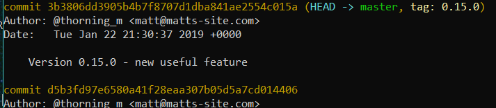

When you release code it's a really good idea to assign a version number to it. This gives users a useful reference number they can send to you if things aren't working as expected (making it easier to track down bugs), gives you a safe point you can roll back to where you know things were working correctly and, as you can see from taking a look at the dependencies and dev-dependencies sections in a package.json, is vitally important if you are planning on building an application which pulls in code from third-party sources.


Fortunately the package.json has a `"version"` property (as seen above) so you can just increment that and commit to git right? Well, that would be one way of doing it but it doesn't let other people using your code know whether the changes you've made are small bug fixes or massive, sweeping changes which are going to render all of their code completely useless. It's also not going to be particularly easy to checkout an old version because you are going to have to search back through your git log to find the commit where you altered the package.json (I hope you wrote a descriptive commit message!).

---

## Semantic versioning

How do we convey an understanding of the impact our changes will have on our users using just the version number? Semantic versioning (or semver for short) allows us to let them know which one of three categories the code we are releasing falls in to:

1. Major Version - These changes will break stuff! If you are updating a dependency to a new major version then you need to set aside some time to rework your code to ensure it works correctly; don't do it on a Friday afternoon!
2. Minor Version - These changes are backwards-compatible features which should not break any existing code, only adding additional functionality.
3. Patch Version - These are backwards-compatible bug fixes and should therefore be safe to use without having to make changes to any code which uses it.

The version number is in three parts, each part separated by a full stop:

**MAJOR.MINOR.PATCH**

If our code is at version _2.15.0_ and we fix a bug, we would release the fix on version _2.15.1_. If we then added a new feature which is not going to break anything then the version would be bumped to _2.16.0_. Notice that the patch version goes to zero when the minor version is incremented. Next, say we decide to rewrite a large portion of our code, changing everything; the version goes to _3.0.0_ because it is likely that any applications which use our code will now be broken. Again, the numbers to the right of the change are reset to zero.

It's important to understand that, aside from the numbers to the right being reset to zero, the three sections are completely independent of one another, you don't increment the major version when you hit 100 minor versions or anything like that. It's not uncommon to see version numbers like _2.256.0_ because developers try to limit the number of breaking changes they release.

---

## Git tagging

So we can now let our users know about the impact our releases are going to have through the version number in the package.json, we just need a way of clearly marking (or tagging!) a commit in our git history as a release. To do this we would need to change the version number in the package.json and then:

```
git add .
git commit -m "Version 0.15.0 - new useful feature"
git tag 0.15.0
```

To push the new commit and tag to the remote repository (if you are using one) you would follow the above with:

```
git push && git push --tags
```

If we check the git log then you should see that there is a commit which has been tagged with our version number.



If, at a later date, we need to rollback to this release then we can easily do so by typing:

```
git checkout 0.15.0
```

---

## Npm version

This is all very useful but that's a lot to do each time you want to release something, especially when you consider that this doesn't _actually release anything!_ Luckily for us, there is a command which will do this for us. To bump the version on the package.json, create a new commit and tag it with the version number you can use one the following commands:

```
npm version major -m "Version %s - Breaking Changes!"
npm version minor -m "Version %s - New stuff in this release!"
npm version patch -m "Version %s - Hopefully this fixes stuff!"
```

Like a commit, the string following `-m` will be the commit message that is displayed in the git log. The `%s` will be substitued for the version number as you can see below:


By default, NPM puts a `v` in front of the version number. I'm sure this won't bother most people but it annoys me so I turn it off! To get rid of the `v` (and add something else if you prefer) you can add a .npmrc file to the root of you project containing this line:

```
tag-version-prefix=""
```

---

## Pre and post version scripts

Do you use the scripts section of the package.json? If not, you should, it's incredibly useful! A typical scripts section for me has scripts for running Webpack, Node servers, Jest (for tests) and release scripts. Here is a picture from the package.json of a chat app I made recently to give you some idea:


As you can see in the above picture, there's a script called `postversion` near the bottom. NPM allows you to create pre and post scripts for any script you like. I could create a "premongo" script or a "postrelease-vps" if I wanted to and NPM would run them exactly where you would expect them to be run. Here, I am using a `postversion` script to push the newly created tagged commit to the remote repository. If I have Eslint or Jest in a project then I run those in a "preversion" script, if either the tests or the linting fail then the version script does not run.

In this app, which is written in [GatsbyJS](https://www.gatsbyjs.org/ "Gatsby's Homepage"), I use a "preversion" script to run Prettier which formats my code nicely (I don't bother using a linter in this codebase because of that) and a "postversion" script to push my git commit & tags and then run the release script which pushes my code to the server:

```json
    "format": "prettier --write \"src/**/*.js\"",
    "preversion": "npm run format",
    "postversion": "git push && git push --tags && ./release.sh"
```

---

That's how I use semantic versioning with NPM to make my releases quick and painless, leaving me with more time to do the important stuff! Thanks for reading, if you have any comments, questions or corrections then feel free to send me a message on [Twitter](https://twitter.com/thorning_m).
