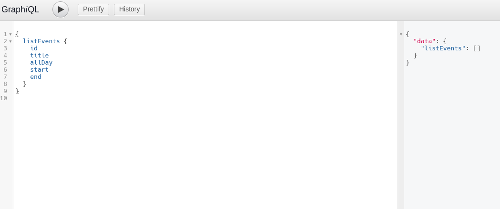

One of the things I've enjoyed most about using Gatsby is learning to use [GraphQL](https://graphql.org/). I've just started creating an app which needs to save calendar events to a database so I thought it would be cool to see if I could create a GraphQL server instead of using [REST](https://en.wikipedia.org/wiki/Representational_state_transfer) endpoints like I normally would. It turns out that creating a GraphQL server capable of basic [CRUD](https://en.wikipedia.org/wiki/Create,_read,_update_and_delete) is a lot easier than I was expecting, here's how I did it.

## What is GraphQL

First, it's probably worth writing a few sentences about what GraphQL is. GraphQL is a query language for APIs. The specification was created by Facebook but there are many different implementations of it for different languages. Unlike REST where you have multiple endpoints, GraphQL works with types and fields; you call one endpoint (usually '/graphql') and specify the type (more on this later) and fields you want to get back from the dataset. Because you tell the API which fields you require, GraphQL is a great way of preventing 'over-fetching' of data which can have negative consequences to users who are using mobile data or are in areas with poor internet speed.

## The packages
I'm writing this in JavaScript because it's the only language I really *know*, I have dabbled with others but unless you use a language day in and day out, it's difficult to make it stick. Besides which, JavaScript is capable of doing so much that I haven't found a good enough reason other than curiosity to move to another language yet. 

Ordinarily I write Node servers with Express, this time I thought it would be fun to try [Koa](https://koajs.com/). Koa is made by the creators of Express and uses ansync functions instead of callbacks, it's also pretty lightweight and  doesn't come with any middleware so you can add only the stuff that you need (we'll be using koa-mount which sets up the routes and koa-graphql which lets us use GraphQL). If you want to use Express instead then the below code will still work, you'll just need to use the Express GraphQL middleware instead. 

I'm also using [Mongoose](https://mongoosejs.com/) for the database layer which allows you to create models for your data which are persisted in [MongoDB](https://www.mongodb.com/).

## Getting started
The first thing you need to do is set up an empty project with `npm init`, then install the packages mentioned above as well as the main GraphQL package which is a collection of constructor functions which we use for creating our schemas and types:
```
npm install koa koa-mount koa-graphql graphql mongoose
```
You're also going to need to have MongoDB installed and running. You can either install this on your computer directly or do like I did and run it in a Docker container. I'm not going to go into how to do that here though, if you can't work it out then let me know and I'll lend a hand.

## Server.js
The first file to write is the entrypoint, I've called it _server.js_, but you can call it whatever you like! Here's the file in full:
```javascript{numberLines: true}
const koa = require('koa');
const graphqlHTTP = require('koa-graphql');
const mount = require('koa-mount');
const schema = require('./graphql/schema');
const mongoose = require('mongoose');
const root = require('./graphql/root');

mongoose.connect(`mongodb://localhost/calendar`, {
  useNewUrlParser: true
});

const db = mongoose.connection
db.on('error', console.error.bind(console, 'connection error:'));
db.once('open', () => console.log('Database connected.'));

const app = new koa();
app.listen(9000);

app.on('error', err => {
  console.log('Server error', err);
});

app.use(
  mount(
    '/graphql',
    graphqlHTTP({
      schema,
      rootValue: root,
      graphiql: true
    })
  )
);
```
At the top of the file we require in all of the packages we're going to use. On _Line 8_ we call `mongoose.connect` which opens a connection to our MongoDB (make sure it's running!) and connects to a database called `calendar`. If the named database doesn't exist then Mongoose will create one for you automatically. Passing the option `{ useNewUrlParser: true }` prevents you from receiving a "DeprecationWarning" message in your console.

Next, we listen for Mongoose to let us know whether the connection was successful or not; I just log the message out in either case. You can move the lines of code which initialise the database connection into a separate file to make things cleaner if you wish, I'm just going to leave them here for the purposes of this article.

On _line 16_ we create a new Koa app and tell it to listen on port 9000, followed by some error handling which just logs the error message again.

Finally on _line 23_ we add the middleware. We use `koa-mount` to create the route `/graphql`; any requests to this URL are passed to the koa-graphql middleware. The GraphQL middleware takes a schema and a rootValue, which we will write later, and we're also telling it to use `graphiql` (pronounced 'graphical'). 

[Graphiql](https://github.com/graphql/graphiql) is a great tool which lets you run queries against your server whilst you are developing it and also when you are developing the frontend which uses it. Graphiql also creates documentation for you automatically, showing anyone who is using your API which types and fields are available and what each one is capable of.

## The Mongoose model

Mongoose uses models which are built from schemas. We're only going to be needing one model for what we're doing but it's good practice to keep them in their own folder in case you need to add more. Here's the directory structure so far:

```
src
 ├── models
 │   └── event.js
 └── server.js
```

The new file is called `event.js`, here it is:
```javascript{numberLines: true}
const mongoose = require('mongoose');

const EventSchema = new mongoose.Schema({
  title: String,
  start: Date,
  end: Date,
  allDay: Boolean
});

module.exports = mongoose.model('Event', EventSchema);
```
This should be pretty self-explanatory. First we create a schema where we declare the fields each model will have and the data types which they will hold. Mongoose then creates a model from this schema, which we export. The one thing I should explain is what the first argument to `mongoose.model` ( _line 10_ ) is for. `'Event'` is the singular name of the collection that Mongoose will look for in the database. It will pluralise and lowercase it, so in this case Mongoose will look for a collection called 'events', if there is no collection of that name then it will create one for us.

## Querying
GraphQL is capable of handling queries and mutations. Queries are used to get data from the API, mutations are used to add, edit or delete data. Let's start by adding a query type with a field that will return an array of all of the records in the _events_ collection.

First we need to create a schema. This is the file that is passed to the GraphQL middleware on _line 27_ of [server.js](#serverjs). I'm going to put this file in its own _graphql_ folder:
```
src
  ├── graphql
  │   └── schema.js
  ├── models
  │   └── event.js
  └── server.js
```
```javascript{numberLines: true}
const { buildSchema } = require('graphql');

module.exports = buildSchema(`
  type Event {
    id: ID,
    title: String
    allDay: Boolean
    start: String,
    end: String
  }
  type Query {
    listEvents: [Event]
  }
`);
```
The `buildSchema` function is called with a string that contains a schema written in GraphQL's own schema language. As I mentioned earlier, GraphQL is organised around types; there is a root `Query` type and a root `Mutation` type. Each of these contains fields of more types, which contain fields of more types, and so on, spreading out like the branches of a tree until a scalar type (Int, Boolean, String) is reached. The scalar types are known as the leaves because trees init. 

The first type we declare in our schema is the `Event` type, this is the output type which will be used by our queries and mutations. Inside, we declare all of the fields that can be returned and the type of data contained in each field. Remember, it's possible to include other custom GraphQL types as well as the scalar types we've used here.

Next, on _line 11_, we declare our root Query type. We'll add one query, `listEvents` which will return an array of `Event` types.

Now we need to add the resolver function which will get the data from our MongoDB. I'll add another file to the _graphql_ folder called _root.js_; this is the other missing file from [server.js](#serverjs) which is added to the GraphQL middleware on _line 28_:
```
src
  ├── graphql
  │   ├── root.js
  │   └── schema.js
  ├── models
  │   └── event.js
  └── server.js
```
```javascript{numberLines: true}
const Event = require('../models/event');

module.exports = {
  listEvents() {
    return Event.find();
  },
}
```
So that's all we need to do to get our data! I've imported the Mongoose `Event` model, when a `listEvents` query is made we just need to call `.find` without any arguments to get all of the records in the collection. Let's try it out...

Head to your browser and go to 'localhost:9000/graphql' (the port and URL we set in _server.js_), you should see the Graphiql interface. 

First I want to show you where the docs are. If you click on the link in the top-right of the screen call _Docs_ and then on _Query_, you should be able to find the query we have just created. Click through until you find the fields which we listed in our Event type in the schema. This seems obvious but it took me longer than I'd like to admit to realise the docs were there!

Now that you've seen how the docs works we can query our API. Copy the following into the left-hand pane:
```
{
  listEvents {
    id
    title
    allDay
    start
    end
  }
}
```
If everything's working correctly you should see the following:



The response is in the right hand pane. At the moment the array is empty because we haven't added anything yet, so let's write a mutation so that we can add some data.

## Create an Event
First we need to add the root mutation type to our _schema.js_ and add the `create` field.
```javascript{numberLines: true}
const { buildSchema } = require('graphql');

module.exports = buildSchema(`
  type Event {
    id: ID,
    title: String
    allDay: Boolean
    start: String,
    end: String
  }
  type Query {
    listEvents: [Event]
  }
  type Mutation {
    createEvent(title: String!, start: String, end: String, allDay: Boolean): Event
  }
`);
```
The new code has been added at _line 14_. If you look at the docs section in Graphiql again you should be able to see the new root type, `Mutation`, under the root Query type. If you click on it you should see that it contains the new `create` field.

The `create` field accepts the arguments which are declared in the parentheses (along with their types) and we have declared the return type after the colon; `Event`, which is our output type from _line 4_.

Now, let's add the resolver function to our _root.js_ file:
```javascript{numberLines: true}
const Event = require('../models/event');

module.exports = {
  listEvents() {
    return Event.find();
  },
  createEvent(input) {
    const newEvent = new Event(input);
    return newEvent.save();
  },
}
```
Our `create` function creates a `new Event` with the `input` which is sent in the request. Calling `save()` on a Mongoose model adds it to the collection in the database.

Let's add an Event! Copy this into the left-hand pane of Graphiql:
```
mutation {
  createEvent(title: "New event", start: "2019-01-01T12:00:00", end: "2019-01-01T14:00:00") {
    id
    title
    allDay
    start
    end
  }
}
```
A couple of things to mention here. After calling `create` with the values we want to set, we are listing the fields which we want the server to respond with from the newly created record. Because we set our return type in the schema to `Event` and returned the newly created Event from our resolver function, GraphQL expects us to follow our mutation with the fields we want it to respond with; if we don't then we will get an error.

You also may have noticed that we have started our request with the word `mutation`. When we made our query earlier, we did not need to label it because GraphQL assumes you are making a query unless you say otherwise. If you wish to make a query and a mutation in the same request then you need to label them both or else you will receive an error:


 
Hopefully you won't get an error though! You should get something like this:


You can see that the server has responded with the fields we requested from our newly created event. The ID was created for us by MongoDB, this is really useful because we can now use this ID to select the events that we want to update and delete.

## Update & delete Events
By now you should be able to see how easy this is, I'm just going to add the update and delete methods in one hit so that we can demonstrate full CRUD. The schema needs to be updated so that it looks like this:
```javascript{numberLines: true}
const { buildSchema } = require('graphql');

module.exports = buildSchema(`
  type Event {
    id: ID,
    title: String
    allDay: Boolean
    start: String,
    end: String
  }
  type Query {
    listEvents: [Event]
  }
  type Mutation {
    createEvent(title: String!, start: String, end: String, allDay: Boolean): Event
    updateEvent(id: String!, title: String, start: String, end: String, allDay: Boolean): Event
    deleteEvent(id: String!): String
  }
`);
 ```
Our two extra mutations have been added, notice that both mutations need the `id` of the event (the exclamation mark in the type declaration means that it cannot be null) also, the delete field returns a `String`.

Here's the _root.js_ file:
```javascript{numberLines: true}
const Event = require('../models/event');

module.exports = {
  listEvents() {
    return Event.find();
  },
  createEvent(input) {
    const newEvent = new Event(input);
    return newEvent.save();
  },
  updateEvent(input) {
    const { id, ...rest } = input;
    return Event.findByIdAndUpdate(id, { $set: rest }, { new: true }).catch(
      err => console.error(err)
    );
  },
  deleteEvent({ id }) {
    return Event.findByIdAndDelete(id)
      .then(event => event.remove())
      .then(() => `${id} successfully deleted`)
      .catch(err => console.error(err));
  }
};
```
The `update` resolver ( _line 11_ ) uses destructuring to separate the id from the fields we want to change. We then use `findByIdAndUpdate` to find the correct record and update it with the new data (`{ $set: rest }`). Passing the option `{ new: true }` makes MongoDB return the updated record instead of the record as it was before being updated. We're also catching any errors and logging them out.

The `delete` resolver only needs the `id` so it destructures it straight away and uses `findByIdAndDelete` to find the record and delete it. Remember from the schema that this method returns a String? Because we have deleted the record, there is little point in returning it, instead we are responding with a confirmation message on _line 20_.

Let's try updating our record:


As you can see in the response, the title of our record has been correctly updated. Now let's delete it:


There's our confirmation message, great success! :+1:

---

We've got full CRUD and hardly had to write any code! Obviously, there are still other considerations to be made before this could be considered production-ready such as security, validation and error-handling but I was pretty impressed at how easy it was to make a functioning backend using these technologies. I have one other tip as a reward for making it to the end. Graphiql is a great tool but it has its limitations. Instead, I've been using an open source application called [insomnia](https://insomnia.rest/) to make my API calls; you can set up your different requests and organise them in folders which is pretty handy, check it out!