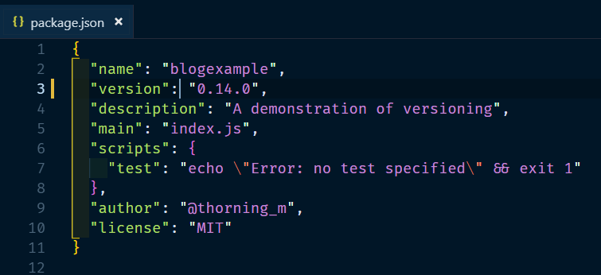
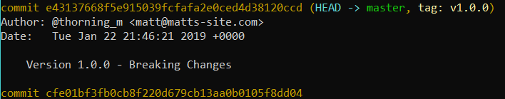

When you release code it's a really good idea to assign a version number to it. This gives users a useful number they can send you if things aren't working as expected (making it easier to track down bugs), it gives you a safe point you can roll back to where you know things were working correctly and it's especially important if you are developing code which is used by other code.



Fortunately the package.json has a `"version"` property so you can just increment that and commit to git right? Well, that would be one way of doing it but it doesn't let other people using your code know whether the changes you have made are small bug fixes or massive, sweeping changes which are going to render all of their code completely useless. It's also not going to be particularly easy to checkout an old version because you are going to have to search back through your git log to find the commit where you altered the package.json (I hope you wrote a good commit message!).

---

## Semantic versioning

How do we convey an understanding of the changes we have made in a release using only the version number? Semantic versioning allows us to let our users know that the code we are releasing falls into one of three categories:

1. Major Version - These changes will break stuff! If you are updating your code to work with a new major release of a dependency then you need to set aside some time to rework your code to ensure it works correctly; don't do it on a Friday!
2. Minor Version - These changes are backwards-compatible features which should not break any existing code, only adding additional functionality.
3. Patch Version - These are backwards-compatible bug fixes and should therefore be safe to use without having to make changes to any code which uses it.

The version number is in three parts, separated by a full stop.

**MAJOR.MINOR.PATCH**

If our code is at version _2.15.0_ and we fix a bug, we would release the fix on version _2.15.1_. If we then added a new feature which is not going to break anything then the version would be bumped to _2.16.0_. Notice that the patch version goes to zero when the minor version is incremented. Next we decide to rewrite a large portion of our code and everything has changed; the version goes to _3.0.0_. Again, the numbers to the right of the change are reset to zero.

It's important to understand that, aside from the numbers to the right being reset to zero, the three sections are completely independent of one another, you don't increment the major version when you hit 100 minor versions or anything like that. It's not uncommon to see version numbers like _2.256.0_ because developers try to limit the number of breaking changes they release.

---

## Git tagging

So we can now let our users know about the impact our releases are going to have through the version number in the package.json, we just need a way of clearly marking (or tagging!) a commit in our git history as a release. To do this we would need to change the version number in the package.json and then:

```
git add .
git commit -m "Version 0.15.0 - new useful feature"
git tag 0.15.0
git push && git push --tags #pushes new commit and tags to remote
```

If we check the git log then you should see that there is a commit which has been tagged with our version number. This can be easily checked out with the command `git checkout 0.15.0`.


---

## Npm version

This is all very useful but there's a lot to do each time you want to release. Luckily for us, there is a command which will do this for us. To bump the version on the package.json, create a new commit and tag it with the version number you can use the following commands.

```
npm version major -m "Version %s - Breaking Changes!"
npm version minor -m "Version %s - New stuff in this release!"
npm version patch -m "Version %s - Hopefully this fixes stuff!"
```

Like a commit, the string following `-m` will be the commit message, the version number will replace the `%s`.



As you can see, by default npm puts a 'v' in front of the version number. I'm sure this won't bother most people but it annoys me so I turn it off! To get rid of the 'v' (and add something else if you prefer) you can add a .npmrc file to the root of you project containing this line:

```
tag-version-prefix=""
```

---

## Pre and post version scripts
